# KakshaSahay — System Architecture & Component Design

## 1. System Overview

**KakshaSahay (कक्षासहाय)** is an offline-first, single-teacher multigrade classroom orchestration companion engineered for primary schools (Grades 1, 2, and 3) operating under the **NIPUN Bharat Foundational Literacy and Numeracy (FLN)** mission.

The core architecture operates **100% client-side** in modern web browsers, guaranteeing zero reliance on external cloud servers, zero network latency during classroom hours, and strict hardware clock delta synchronization.

---

## 2. End-to-End System Architecture Diagram

```mermaid
flowchart TD
    subgraph ClientBrowser ["Client Browser (PWA Environment)"]
        subgraph PresentationLayer ["Presentation & UI Layer (index.html)"]
            Hero["Hero & CTA (Start Session, Offline Diag, Export)"]
            MGMLDash["1-Teacher Multigrade Orchestration Bar"]
            Cards["3-Grade Status Cards (G1, G2, G3)"]
            Solver1["Solver 1: 15-Min Rotation Engine"]
            Solver2["Solver 2: Bhasha Setu Language Bridge"]
            Solver3["Solver 3: Absentee Catch-Up Triage"]
            Solver4["Solver 4: Zero-Cost Chalkboard TLM"]
            RationaleBox["Explainable Allocation Rationale Box"]
            DiagModal["Live Offline Diagnostic Modal"]
        end

        subgraph CoreEngineLayer ["Core Orchestration & Logic Layer"]
            OrchEngine["Orchestration Engine (src/core/orchestrationEngine.js)"]
            ExplEngine["Explanation Engine (src/core/explanationEngine.js)"]
            StateStore["Reactive State Store & FSM (js/state.js)"]
            RAG["Local Curriculum RAG (60 NIPUN Bharat modules)"]
        end

        subgraph ServiceLayer ["Hardware & Storage Services"]
            AudioCoord["Audio Coordinator (src/services/audioCoordinator.js)"]
            StorageSvc["Storage Vault & Service (src/services/storage.js)"]
            ClockSync["Hardware Clock Delta Timer"]
        end

        subgraph BrowserAPIs ["Native Browser Web APIs"]
            WebAudio["Web Audio API (Oscillator Bell Chimes)"]
            WebSpeech["Web Speech API (Hindi TTS + Voice Pack Fallback)"]
            BC["BroadcastChannel ('kakshasahay_speech_channel')"]
            SW["Service Worker & Cache API (sw.js)"]
            LocalStorage["Encrypted LocalStorage (kakshasahay_*)"]
            PageVis["Page Visibility API (Document Hidden Guard)"]
        end
    end

    subgraph OptionalEdge ["Optional Developer Edge (Non-Essential)"]
        GeminiFlash["Gemini Flash API (Only if BYOK Configured)"]
    end

    %% Interactions
    Hero -->|"1-Click Start"| OrchEngine
    Hero -->|"Open Self-Check"| DiagModal
    Cards -->|"Adaptive Support Flag"| OrchEngine
    OrchEngine -->|"Recalculate Allocation"| StateStore
    StateStore -->|"Notify State Change"| MGMLDash
    StateStore -->|"Notify State Change"| Cards
    StateStore -->|"Generate Explanation"| ExplEngine
    ExplEngine -->|"Render 2-4 Factual Reasons"| RationaleBox

    Solver1 -->|"15-min Cycle Ticks"| ClockSync
    ClockSync -->|"Cycle Expiration Chime"| AudioCoord
    AudioCoord --> WebAudio
    AudioCoord --> WebSpeech
    AudioCoord --> BC
    PageVis -->|"Tab Inactive"| AudioCoord

    Solver2 -->|"Local Query"| RAG
    Solver3 -->|"Enqueue Student"| StorageSvc
    StorageSvc --> LocalStorage
    SW -->|"Cache Assets"| PresentationLayer

    Solver2 -.->|"Optional Cloud Fallback"| GeminiFlash
```

---

## 3. Core Architectural Subsystems

### 3.1. Single-Teacher Multigrade Invariant Engine
In Indian rural primary schools, one teacher frequently oversees Grades 1, 2, and 3 concurrently in a single classroom. The orchestration engine enforces a strict mathematical invariant:

$$\sum_{g \in \{1,2,3\}} \mathbb{I}(\text{Mode}(g) = \text{Teacher-Led}) = 1$$

At any given moment, **exactly one grade** is engaged in direct instruction with the teacher. The other two grades are deterministically allocated to:
- **Independent Slate Practice:** Self-paced numeral tracing, base-10 bundle tallying, and chalkboard model copying.
- **Collaborative Peer Dyads:** Front-row paired buddies verifying calculations, verbalizing phonemes, or roleplaying market word problems using zero-cost pebble currency.

### 3.2. Adaptive Recalculation & Teacher Override
Teachers are not bound to rigid static timers. When a teacher detects that students in Grade 2 are struggling with subtraction borrowing:
1. The teacher taps **"🙋 Mark Needs Support"** on the Grade 2 card.
2. `OrchestrationEngine.recalculateAllocation()` dynamically updates the rotation schedule.
3. Grade 2 immediately transitions to **Teacher-Led (प्रत्यक्ष)**.
4. Grade 1 and Grade 3 transition safely to **Independent** and **Peer** modes.
5. The **Explanation Engine** updates the transparent rationale without buzzwords:
   > *"Rotation changed because Grade 2 was marked as requiring additional teacher support."*
6. An entry is recorded in the session audit trail.

### 3.3. Zero-Network Audio Concurrency Architecture
Audio collisions (multiple tabs speaking simultaneously or overlapping chimes) cause severe classroom disruption. KakshaSahay implements a three-tiered concurrency guard:
1. **Same-Tab Pre-emption:** `AudioCoordinator.speak()` immediately cancels any pending or active speech via `speechSynthesis.cancel()` before enqueuing a new utterance.
2. **Page Visibility API Integration:** When the teacher switches tabs or minimizes the browser, the `visibilitychange` listener cancels active speech instantly.
3. **Cross-Tab Synchronization:** A dedicated `BroadcastChannel('kakshasahay_speech_channel')` informs peer tabs of speech events, suppressing overlapping audio across tabs.
4. **Client-Side Acoustic Bell:** Dual-tone chime ($587.33\text{ Hz} \to 880\text{ Hz}$) synthesized dynamically using Web Audio API oscillators, requiring zero external MP3 downloads.

### 3.4. Offline Data Protection & Storage Isolation
- **Scoped Namespace:** All application keys are strictly isolated under the `kakshasahay_*` prefix.
- **Legacy Migration:** Automatically detects and safely migrates legacy `vidyasetu_*` keys to `kakshasahay_*` on startup without data loss.
- **Encryption Vault:** Identifiable student remediation records are encrypted using PBKDF2 key derivation and AES-GCM via the Web Crypto API, with an obfuscated XOR fallback for legacy environments.
- **Selective Data Reset:** "Clear Local Data" wipes only `kakshasahay_*` keys, leaving unrelated host data untouched.
- **JSON Data Export:** Teachers can export complete rosters and weekly diagnostic metrics into clean JSON for administrative handoffs.

---

## 4. Failure Modes & Graceful Degradation

| Subsystem | Potential Failure Mode | Degradation Strategy |
| :--- | :--- | :--- |
| **PWA Cache** | Aggressive OS cache eviction | Core code is contained within lightweight, zero-dependency static bundles that load rapidly even over 2G networks. |
| **Web Speech API** | Hindi TTS voice pack missing on low-end device | Visual banner notification automatically displays the text dialogue, while screen-reader ARIA live regions ensure accessibility. |
| **Hardware Audio** | Browser autoplay policy blocks AudioContext | First teacher click unlocks audio context; graceful silent fallbacks if audio is blocked. |
| **Web Crypto API** | Unsupported in legacy Android WebViews | Fallback to UTF-8 byte XOR codec ensures data persistence without runtime crashes. |
| **External LLM** | No internet connection or invalid API key | Purely client-side offline RAG engine resolves all curriculum prompts deterministically from bundled NIPUN Bharat data. |

---

## 5. Security & Threat Boundary
1. **Strict Content Security Policy (CSP):** `default-src 'self'; script-src 'self' 'unsafe-inline'; style-src 'self' 'unsafe-inline'; connect-src 'self' https://generativelanguage.googleapis.com; frame-src https://drive.google.com; media-src 'self' blob:; img-src 'self' data:;`
2. **Zero DOM XSS:** Strictly uses `textContent`, `replaceChildren()`, and an explicit HTML sanitizer for all dynamic content rendering.
3. **Privacy First:** Zero trackers, zero third-party telemetry, zero student identifying data transmitted to the cloud.
